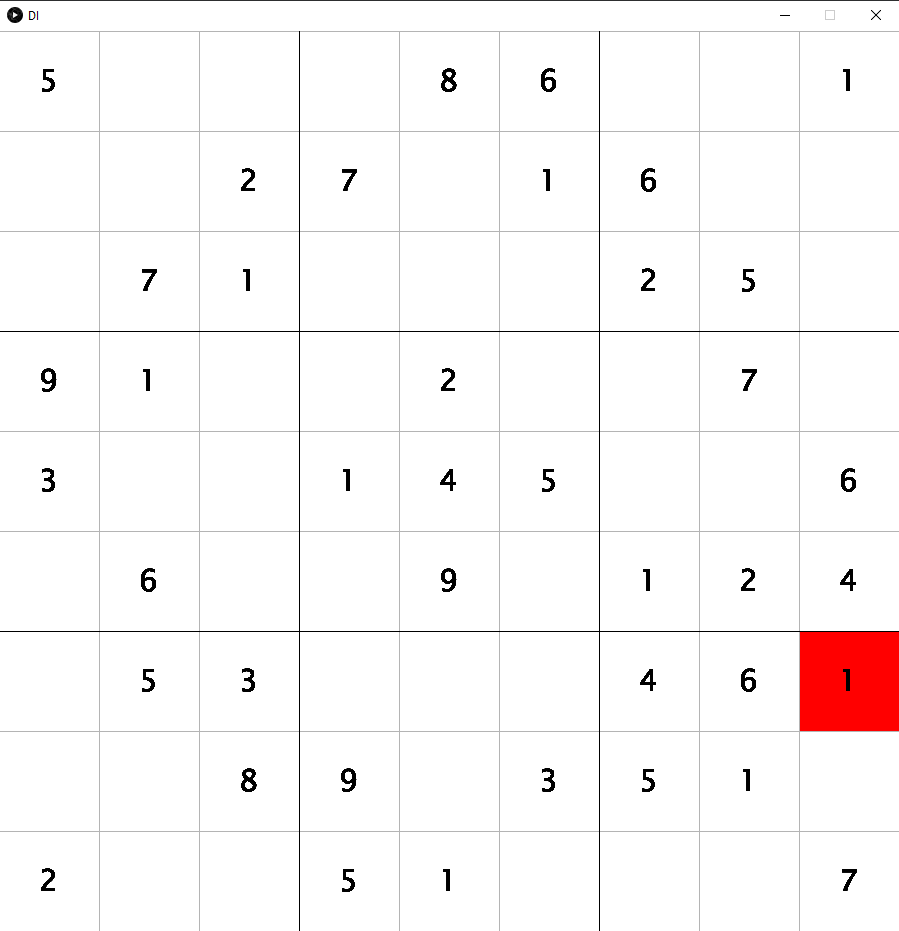

# Kurzbezeichnung für Ihr Spiel, Ihre Simulation oder Animation (PiS, SoSe 2021)

Autor: Mehmet Algül, 5273858

## Kurzbeschreibung (50-150 Wörter)

Mein Spiel ist Sudoku mit drei Schwierigkeitsgraden (Easy, Middle und Hard). Ziel des Spiels ist es alle leeren Felder 
mit Zahlen im Bereich von 1 bis 9 auszufüllen. Dabei ist zu beachten, dass pro Reihe, pro Zeile und pro 3 x 3 Feld 
jeweils nur eine Zahl im Bereich von 1 bis 9 stehen darf. (55 Wörter)

## Screenshot

## Bedienungshinweise

Bevor das Spiel wie im Screenshot startet, muss vorher im Menü mit einer Tasteninteraktion ein Schwierigkeitsgrad
ausgewählt werden (Auswahl von Easy(`1`), Middle(`2`) und Hard(`3`)). Die Zahlen werden mittels Tastaturinteraktion 
eingesetzt.
Falls eine Zahl falsch gesetzt worden ist, gibt es die Tasteninteraktion `u`, der für UndoMove steht.
Dieser kann allerdings nicht als erster Zug ausgeführt werden.
Vorher muss per Mausklick das Feld, in der die Interaktion ausgeführt werden soll, angeklickt werden.
Felder, die grau markiert sind bedeuten, dass aktuelle Feld in der sich der Spieler
befindet. Das Feld, das rot markiert ist (siehe Screenshot), ist ein Zeichen für einen Fehler.
Des Weiteren existiert die Tasteninteraktion `h`, um im angeklickten Feld eine Lösung des Feldes zu erhalten.
Außerdem existiert die Tasteninteraktion `b`, dass zurück zum Menü führt.
Im Falle eines Sieges oder Verlierens wird mit der Tasteninteraktion `e` das Spiel verlassen.

## Dateiübersicht und Lines of Code

    > dir /S /B /A-D .
    \README.md
    \Screenshot.png
    \app\build.gradle
    \app\core.jar
    \app\src\main\java\Pis_Sudoku\DI.java
    \app\src\main\java\Pis_Sudoku\GameEngine.java
    \app\src\main\java\Pis_Sudoku\SudokuInterface.java
    \app\src\test\java\Pis_Sudoku\AppTest.java

    -------------------------------------------------------------------------------
    Language                     files          blank        comment           code
    -------------------------------------------------------------------------------
    Java                             3             64              7            443
    -------------------------------------------------------------------------------
    SUM:                             3             64              7            443
    -------------------------------------------------------------------------------

## Verwendete Quellen

* Java der Grundkurs-Michael Kofler (Abruf, 16.6.2021)
* https://www.bing.com/images/search?view=detailV2&ccid=q537R0yn&id=17A59327B79D5812B883998B1B4B5A844813B23D&thid=OIP.q537R0ynUwpMVU_nj8OXBgHaHa&mediaurl=https%3a%2f%2fth.bing.com%2fth%2fid%2fRab9dfb474ca7530a4c554fe78fc39706%3frik%3dPbITSIRaSxuLmQ%26riu%3dhttp%253a%252f%252f3.bp.blogspot.com%252f-i8CCYw5ZZKc%252fTm7183i_KAI%252fAAAAAAAAK8A%252fHtNcH7pnyN0%252fs1600%252feasy%252bsodoku%252bto%252bprint.jpg%26ehk%3dMH54JxHrDn%252fta7RSj02reZMypVRoRRa%252bf3PzRQLYf64%253d%26risl%3d%26pid%3dImgRaw&exph=1028&expw=1028&q=sudoku+easy&simid=608047385006000663&ck=007E63136C8088F669168DA0E54434B3&selectedIndex=0&FORM=IRPRST&idpp=overlayview&ajaxhist=0&ajaxserp=0 (Abruf, 29.5.2021)
* https://www.bing.com/images/search?view=detailV2&ccid=5ICgJNG%2f&id=10574EAFED815925D9603F8D83E055FFF785F62A&thid=OIP.5ICgJNG_nSfK_tSBmMETIwHaHa&mediaurl=https%3a%2f%2fth.bing.com%2fth%2fid%2fRe480a024d1bf9d27cafed48198c11323%3frik%3dKvaF9%252f9V4IONPw%26riu%3dhttp%253a%252f%252fwww.sudoku-raetsel.net%252fsudoku-raetsel-mit-loesung%252f90-sudoku.gif%26ehk%3dB1sChqaQB%252fKuPbP9be3oHlfNYEBzyugs7YOpVs7gtx8%253d%26risl%3d%26pid%3dImgRaw&exph=581&expw=581&q=sudoku+mittel&simid=607986941947638740&ck=790E6064922257AC3A6457ED2DC4D1B8&selectedIndex=3&FORM=IRPRST&ajaxhist=0&ajaxserp=0 (Abruf, 29.5.2021)
* https://www.bing.com/images/search?view=detailV2&ccid=GaE15VkC&id=3A66A305B38D373B960CCDFB74BD63515E0B29F2&thid=OIP.GaE15VkCEIjxJVQEIkBPmwHaKf&mediaurl=https%3A%2F%2Fth.bing.com%2Fth%2Fid%2FR19a135e559021088f125540422404f9b%3Frik%3D8ikLXlFjvXT7zQ%26riu%3Dhttp%253a%252f%252fwww.raetseldino.de%252fsudoku-schwer%252fsudoku-13-schwer.jpg%26ehk%3DfMM6Ie9FuwqBxFOxICEK6PV7UvUlxi%252fpibSx5RHKkyw%253d%26risl%3D%26pid%3DImgRaw&exph=850&expw=600&q=sudoku+schwer&simid=608002386634299047&ck=33EF38BFD4045982409A1DF7D5508E7D&selectedindex=2&form=IRPRST&ajaxhist=0&ajaxserp=0&vt=0&sim=11 (Abruf, 29.5.2021)
* https://moodle.thm.de/pluginfile.php/782932/mod_resource/content/1/Datenstrukturen_U%CC%88bung.pdf (Abruf, 23.6.2021)
* https://moodle.thm.de/pluginfile.php/325977/mod_resource/content/4/02_streams.html (Abruf, 25.6.2021)
* https://moodle.thm.de/pluginfile.php/325978/mod_resource/content/1/03_streams.html (Abruf, 25.6.2021)
* https://www.youtube.com/watch?v=PZJ5mjQyxR8 (Abruf, 17.6.2021)
* https://www.youtube.com/watch?v=Nu5lZ3oxl9s (Abruf, 20.6.2021)
* https://drive.google.com/file/d/1i_ESgfff8VmCQk7kN8QFopR5Yqxi7fa_/view (Abruf, 29.6.2021)
* https://github.com/DSpengler99/pis_faq_ss21 (Abruf, 02.7.2021)